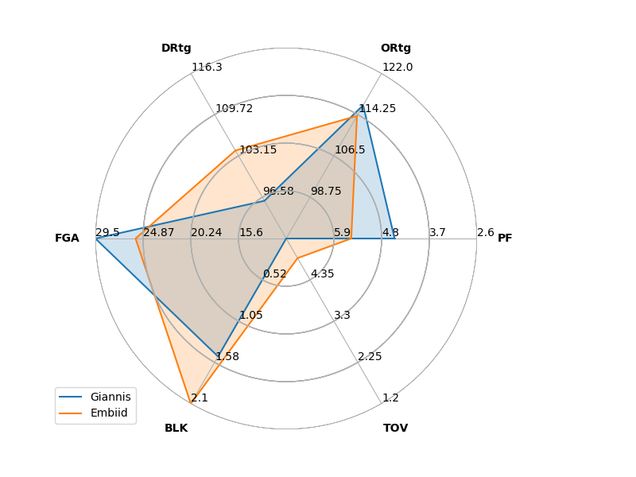

# Examples

## Scatter Plots

For scatter plots, data can be retrieved from either the sportsreference or the basketball_reference_scraper package. Using basketball_referene_scraper packages provides multiple stat types like per game and per possession whille sportsreference is only useful for season totals.

### Functions using sportsreference for scraping

##### Season based

- VORP of two players throughout their career


```python
nbagrapher.plot_player_season(['iversal01','bryanko01'],"value_over_replacement_player")
```


- PER of the last five MVPs over the last five years

```python
nbagrapher.plot_player_season(['antetgi01','hardeja01','westbru01','curryst01','duranke01'],"player_efficiency_rating",start_year=2014,end_year=2019)
```


- Cumulative points of the five top points scorers over the last decade

```python
nbagrapher.plot_player_season(['jamesle01','duranke01','hardeja01','westbru01','curryst01'],"points",start_year=2010,cum=True)
```

##### Game based
- Win Shares for January 2019
```python
nbagrapher.plot_player_game(['embiijo01','antetgi01'],2019,"true_shooting_percentage",start_date=datetime.date(2019,1,1),end_date=datetime.date(2019,2,1))
```


## Functions using basketball_reference_scraper

##### Season based

- Points per 100 possession in the playoffs from 1990 to 1996
```python
nbagrapher.player_season(["jordami01","pippesc01","drexlcl01"],stat="PTS",stat_type="PER_POSS",players_label=["Michael Jordan","Scottie Pippen","Clyde Drexler"],playoffs=True,start_year=1990,end_year=1996)
```


## Shot Charts

##### Simple chart for Kawhi Leonard in the 2019 playoffs
```python
nbagrapher.player_shot_chart_season("leonaka01",season=2019,playoffs=True)
```


##### Hex chart with adjusted FG% as the value for hexbin.
```python
nbagrapher.player_shot_chart_season("leonaka01",season=2019,playoffs=True,fig_type="hex",hex_C="fg%_adj",hex_minshots=5)
```


## Radial Charts
#### With a template
```python
nbagrapher.player_season_radar(["antetgi01","embiijo01"],season=2020,player_labels=["Giannis","Embiid"],template="shooting")
```


### Without a template
```python
nbagrapher.player_season_radar(["antetgi01","embiijo01"],season=2020,player_labels=["Giannis","Embiid"],stats=["PF","ORtg","DRtg","FGA","BLK","TOV"],stat_type="PER_POSS")
```

